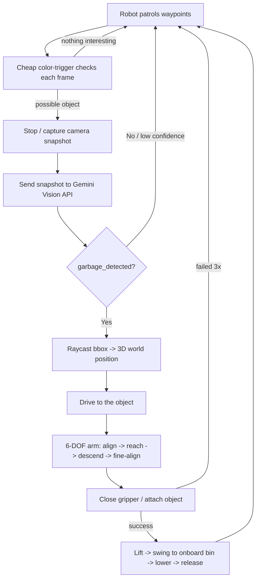

# Smart Waste-Collection Robot — Project Explainer

**A one-page-to-full-depth guide for explaining this project to faculty.**
Read the "60-Second Pitch" first, then use the deeper sections as backup for
follow-up questions.

---

## 1. 60-Second Pitch

> "We simulated a fully autonomous garbage-collecting robot. It patrols an
> outdoor plaza, uses **Google Gemini's vision model** to look at its camera
> feed and identify real trash (not hard-coded object IDs), works out the
> object's 3D position using the simulator's own depth camera and raycasting,
> drives up to it, and picks it up with a **6-degree-of-freedom robotic arm**
> that moves joint-by-joint like a real robot arm would — base, shoulder,
> elbow, wrist, gripper — instead of teleporting. It drops the item in an
> onboard bin and goes back to patrolling. Everything is built in Python on
> the MuJoCo physics engine, so it runs on a normal laptop with no GPU and no
> physical hardware."

That's the whole thing. Everything below explains **how**.

---

## 2. Why this project / problem statement

Manual litter collection in public spaces (parks, plazas, campuses) doesn't
scale. The long-term goal is a robot that can patrol autonomously, tell real
litter apart from background clutter using vision (not a fixed list of
colors or shapes), and physically retrieve it. Before building that on real
hardware, this project proves the **software architecture** end-to-end in
simulation: perception → decision → navigation → manipulation, in a closed
loop, with no human in the middle.

---

## 3. Tools & Technologies Used

| Tool | Role in the project | Why this one |
|---|---|---|
| **Python 3** | Everything is written in Python | Fast to iterate, huge ecosystem for robotics/AI glue code |
| **MuJoCo** (`mujoco` pip package) | Physics engine — simulates gravity, contact, joints, and renders the robot's camera | Free, installs with a single `pip install` on Windows (unlike ROS 2 + Gazebo, which need Linux), fast enough for real-time on a laptop, and gives a real virtual RGB-D camera and 3D viewer out of the box |
| **Google Gemini API** (`google-genai`) | The "brain" of perception — looks at a camera snapshot and decides what's trash | This is the actual AI vision model doing the detection, not a placeholder. It reasons about the image the way a person would ("that's a bottle, that's a rock") |
| **NumPy** | All the math — vectors, matrices, coordinate transforms | Standard for numerical work in Python |
| **OpenCV (`cv2`)** | Two jobs: (1) a cheap color-blob detector used as a fast local trigger, (2) drawing the on-screen dashboard | Lightweight, well-known computer-vision toolkit |
| **PyYAML** | Loads `config/simulation.yaml` — all tunable parameters in one place | Keeps configuration out of code |
| **python-dotenv** | Loads the Gemini API key from a local `.env` file | Keeps the secret key out of source code / git |

**Nothing here needs special hardware.** No webcam, no GPU, no robot. The
"camera" is MuJoCo's own offscreen renderer pointed at the simulated scene.

---

## 4. The End-to-End Pipeline



This is a **state machine** (a robot-standard way to structure behavior:
"be in exactly one named state at a time, decide what to do, decide the next
state"). The actual states in the code are:

```
IDLE → PATROLLING → POTENTIAL_GARBAGE_FOUND → CAPTURING_IMAGE →
GEMINI_ANALYSIS → APPROACHING_TARGET → ARM_POSITIONING → GRABBING →
LIFTING → MOVING_TO_BIN → RELEASING → ARM_RESET → (back to PATROLLING)
```

Every transition prints a log line, e.g.:

```
[POTENTIAL_GARBAGE_FOUND] local trigger -- can conf=0.73 bbox=(610,109,640,183)
[CAPTURING_IMAGE] Snapshot captured from virtual camera
[GEMINI_ANALYSIS] Gemini request started (model=gemini-3.6-flash)
[GEMINI_ANALYSIS] Gemini response received
  garbage_detected=true type=can confidence=0.95 bbox=(597,315,640,387)
[ARM_POSITIONING] phase 2/3 -- reach (shoulder -> elbow -> wrist -> descend)
[GRABBING] garbage grasped successfully
[RELEASING] garbage deposited in bin (total collected=1)
```

This is the single best thing to **show live** to faculty — it reads like a
transcript of the robot's own decisions.

---

## 5. Deep Dive: Each Subsystem

### 5.1 The Simulated World (MuJoCo)

The plaza (grass, paths, buildings, trees, benches, bins) and the robot are
not hand-modeled files — they're **generated by Python code** into a single
MJCF XML document (`simulation/scene.py`) that MuJoCo loads. This means the
whole world is parametric: change a number in `config/simulation.yaml` and
the plaza size, number of waste items, or camera field-of-view all change
automatically.

**Waste items are not simple boxes.** Each type (bottle, can, plastic bag,
cardboard, food container) is built from *several* shapes glued together —
a bottle is a body + shoulder + neck + cap + label ring, for example — so it
visually reads as that object, not a colored cube. Every part is also real
collision geometry, so the gripper can physically grab it.

### 5.2 The Robot

- **Mobile base**: 4-wheel skid-steer, controlled by linear + angular
  velocity (`v, w`) — the same interface a real differential-drive robot
  uses (`cmd_vel` in ROS terms).
- **Camera**: mounted on a mast, pitched slightly down. It's a true RGB-D
  (color + depth) virtual camera — MuJoCo renders it exactly like the 3D
  viewer, just from the robot's point of view.
- **Arm**: 6 revolute joints in series (a real 6-DOF chain) + a
  two-finger gripper.
- **Basket**: mounted on the back of the chassis — the "collection bin" for
  this design (see §7 for why we kept it onboard rather than a separate
  external bin).

### 5.3 Perception — Two-Tier Detection

Calling a cloud AI model every single video frame would be slow and
expensive. So detection happens in two tiers:

1. **Tier 1 — cheap, local, every frame.** A simple OpenCV color-blob check
   asks "does anything object-sized and non-background-colored appear in
   the lower part of the frame?" This never calls the internet.
2. **Tier 2 — expensive, real AI, rate-limited.** Only when Tier 1 fires
   (and a cooldown timer has elapsed) does the robot actually capture a
   JPEG and send it to **Gemini**.

This mirrors how a real system would be built: a fast, dumb filter protects
an expensive, smart model from being called constantly.

### 5.4 Gemini Vision Integration

The prompt sent to Gemini (`src/waste_robot/gemini_detector.py`) explicitly
tells the model:

- It's looking at a garbage-collection robot's camera.
- Ignore the robot itself, the ground, walls, buildings, trees, bins.
- Only report actual litter, and only if it looks reachable by a small arm.
- Respond in **strict JSON**, nothing else.

Expected response shape:

```json
{
  "garbage_detected": true,
  "objects": [
    {
      "garbage_type": "plastic_bottle",
      "confidence": 0.92,
      "bounding_box": {"x": 0.45, "y": 0.52, "width": 0.12, "height": 0.25},
      "description": "Plastic bottle lying on the ground"
    }
  ]
}
```

The parser is written to tolerate messy real-world model output: markdown
code fences, a single object instead of a list, slightly different field
names — so one weird response doesn't crash the mission.

**Important:** Gemini is genuinely deciding this from pixels, every time.
Nothing in the code says "if object name == waste_3, it's a bottle." That
would defeat the purpose of using an AI vision model at all.

### 5.5 Turning a 2D Box into a 3D Position (Coordinate Estimation)

Once Gemini says "there's a bottle, here's its box in the image," the robot
needs a real (x, y, z) point in the world to drive to. Two techniques,
layered:

1. **Raycasting (primary)** — the simulator fires a single ray from the
   camera through the center of that bounding box, exactly like a laser
   pointer, and asks MuJoCo "what does this ray physically hit first?" If
   it hits real waste geometry, we now have an exact, simulator-verified 3D
   point — not a guess.
2. **Depth-camera fallback** — if the ray is inconclusive, we fall back to
   reading the camera's own depth buffer at that pixel and reprojecting it
   into world coordinates using the camera's field of view and pose (basic
   pinhole-camera geometry).

If the ray instead hits a **decoy** object (a rock, a plant, a wood block —
things intentionally placed to look trash-like but aren't), the detection
is rejected outright. This is the simulator standing in for "does this
actually correspond to a real object at all," which is what stereo/depth
sensing does on a real robot.

### 5.6 Navigation

- **A\*** path planning on a known obstacle map gets the robot from its
  current position to an approach point near the target.
- **Lidar reactive avoidance** (36 simulated range rays) nudges the robot
  away from anything close in front of it while driving, the same idea as
  a Roomba's bump/proximity sensors, just simulated with raycasts.
- **Patrol mode** cycles through a fixed loop of waypoints across the plaza
  when nothing is being chased, so the robot is always doing something
  purposeful rather than sitting still or wandering randomly.

### 5.7 The 6-DOF Arm — the Most Interesting Engineering Story

This is worth spending the most time on with faculty, because it's where
the real debugging happened.

**The goal:** when the arm moves, each of its 6 joints should visibly do its
own distinct job — base rotates, *then* shoulder drops, *then* elbow bends,
*then* wrist orients, *then* gripper closes — the way a real robot arm's
motion reads as "an arm," not "a rigid shape sliding around."

**How arm motion is computed:** the arm uses **inverse kinematics (IK)** —
given a target point in space, solve for the 6 joint angles that put the
gripper there. This project uses a **Jacobian-based iterative solver**: it
repeatedly nudges the joint angles in the direction that reduces the
distance between the gripper and the target, using the arm's Jacobian
matrix (a mathematical object that relates joint-angle changes to
end-effector movement) as the "which direction helps" signal.

**The bug we found and fixed:** the IK solver was written to *evaluate*
candidate poses by actually moving the simulated joints while it searched
for a solution. That meant by the time the solver returned an answer, the
simulated arm was *already* sitting at the answer — so when the animation
code went to interpolate "from where it is now, to the goal," those two
points were the same thing, and the arm appeared to teleport instantly. The
fix: the solver now always restores the arm to its exact starting pose
before returning its answer, so the caller can animate a real, visible
transition from start to goal.

**Staged motion:** instead of moving all 6 joints toward the solution at
once, the pickup is broken into phases, each animating a different subset
of joints while the others hold still:

| Phase | Joints that move | What it looks like |
|---|---|---|
| 1. Align | base rotation only | arm's waist turns to face the object |
| 2. Reach | shoulder → elbow → wrist → forearm | arm swings up and over, then lowers onto the object |
| 3. Fine-align | wrist joints only | small last-centimeter adjustment |
| 4. Grab | gripper fingers | close around the object |
| 5. Lift | wrist → elbow → shoulder | lifts straight up, retracting |
| 6. Deposit | base → shoulder/elbow → wrist | swings around to the onboard bin and lowers |
| 7. Release | gripper fingers | opens, drops the item |
| 8. Reset | all joints together | returns to a safe home pose |

Base rotation is done with **simple trigonometry** (angle-to-target), not
IK — a single rotating joint can't satisfy a full 3D position target (that
needs at least 3 independent joints), so trying to use IK for it was itself
a bug that had to be found and fixed.

### 5.8 Failure Handling

Real systems fail gracefully instead of getting stuck. This one:

- Retries a failed grasp up to 3 times, then gives up on that item and
  resumes patrol instead of freezing.
- Rejects a Gemini detection that's below the confidence threshold.
- Rejects a raycast hit on a decoy object.
- Catches Gemini API errors (network issues, bad response) and logs them
  without crashing the mission.

---

## 6. Project Structure

```
GarbageDetector/
├── config/simulation.yaml        # every tunable number lives here
├── simulation/
│   ├── scene.py                  # builds the MJCF world + robot + waste as XML
│   ├── assets/waste.py           # compound-geometry waste item definitions
│   └── worlds/park_plaza.py      # obstacle map + A* pathfinding
├── src/waste_robot/
│   ├── engine.py                 # MuJoCo wrapper: physics step, camera, raycast, lidar
│   ├── camera.py                 # virtual RGB-D camera
│   ├── detector.py               # detector interfaces + the color-blob "mock" detector
│   ├── gemini_detector.py        # Gemini prompt, API call, JSON parsing
│   ├── coordinate_estimator.py   # 2D bbox -> 3D world position (raycast + depth)
│   ├── navigation.py             # A* + lidar avoidance
│   ├── mobile_base.py            # wheel/velocity control
│   ├── arm.py                    # 6-DOF IK + staged joint motion
│   ├── mission.py                # the state machine tying it all together
│   ├── dashboard.py              # on-screen HUD (OpenCV window)
│   └── metrics.py                # mission report (collected, success rate, etc.)
├── scripts/run_simulation.py     # entry point
├── tests/test_pipeline.py        # unit tests
└── .env                          # GEMINI_API_KEY (not committed to git)
```

---

## 7. Key Design Decisions (good Q&A ammunition)

**Q: Why MuJoCo instead of ROS 2 + Gazebo, which is the "real" robotics stack?**
A: ROS 2 + Gazebo is Linux-first; getting it running on a Windows student
laptop eats a week in install problems before any actual work starts.
MuJoCo installs with one `pip install`, gives a real physics engine and a
real virtual camera, and the whole architecture (a state machine reading a
camera topic, publishing velocity commands) is written to be a drop-in
replacement path to ROS 2 later — the in-process message `Bus` uses ROS 2
topic names on purpose.

**Q: Why generate 3D assets in code instead of downloading real models?**
A: Free 3D asset licensing is genuinely murky, and downloading meshes at
runtime adds a network dependency and file-format headaches (units, scale,
collision geometry). Building recognizable multi-part shapes procedurally
keeps everything offline, license-clean, and instantly reproducible for
grading/demo — and doubles as real collision geometry for free.

**Q: Why an onboard basket instead of a separate collection bin?**
A: It's the existing project's architecture and already reads visually as
"a robot with a bin on its back," which is a completely normal design for
a real litter-collecting robot. Adding a separate stationary bin with its
own navigation target was extra scope the brief didn't require.

**Q: Isn't the color-based trigger "cheating" instead of using AI everywhere?**
A: No — it's a standard **coarse-to-fine** design (cheap filter, expensive
model). Gemini is still the one making every actual trash/not-trash
decision; the trigger just decides *when to bother asking*.

**Q: How do you know Gemini isn't just being told the answer?**
A: The prompt only describes the *task* ("find litter, ignore the robot and
scenery, return this JSON shape"). The image sent is a real rendered
camera frame with no metadata about object identities — Gemini is doing
actual visual classification.

---

## 8. Metrics the Simulation Reports

Every run prints and saves (`outputs/mission_<scenario>.json`):

```
Waste detected / collected, pickup success rate, failed grasps,
mean detection confidence, distance travelled, navigation time,
collisions, Gemini confirmed/rejected counts, detection FPS
```

This gives objective numbers to put in a report or slide, not just "it
worked when I watched it."

---

## 9. Live Demo Script (for tomorrow)

```powershell
# 1. Fast, no windows — proves the whole pipeline works, prints a report
python scripts/run_tests.py

# 2. Full visual demo — 3D viewer + camera window with live detections
python scripts/run_simulation.py --scenario multi
```

While it runs, narrate using the terminal log lines (§4) — point at each
bracketed state name as it appears and say what's happening. If asked to
prove it isn't hard-coded, point at the `[GEMINI_ANALYSIS]` lines that show
the *actual* JSON Gemini returned for that specific frame.

---

## 10. Honest Limitations (mention these proactively — it reads as rigor, not weakness)

- This is a simulation; sim-to-real transfer (lighting, real depth noise,
  real gripper compliance) is a separate, later problem.
- Grasping is a simplified "close gripper + attach if close enough"
  constraint, not a physically simulated contact-rich grasp.
- Navigation uses a known static obstacle map, not real-time SLAM.
- The upgrade path for each simplification is documented in `README.md`
  §7 (e.g., MoveIt 2 for real arm planning, Nav2 for real navigation).
